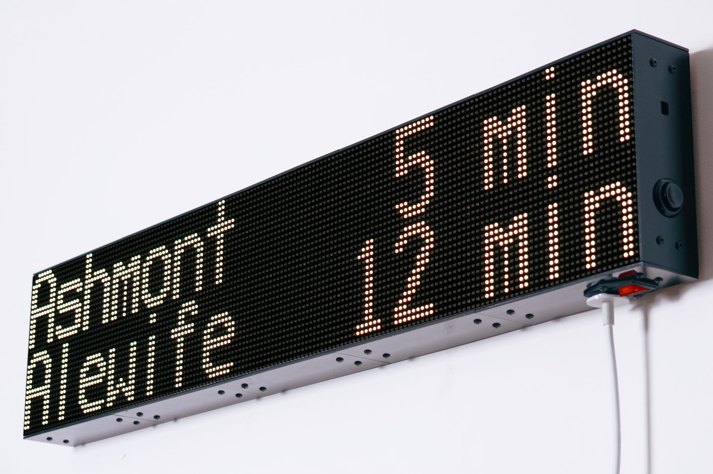
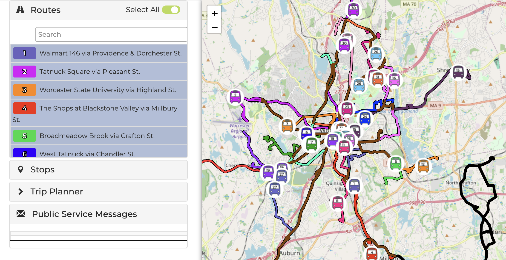
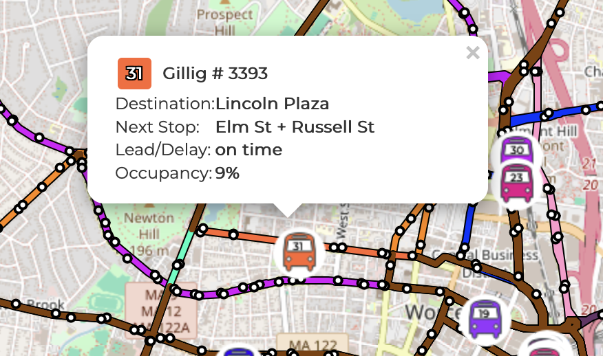

# Introduction

The open transit data ecosystem runs on GTFS-RT. Encoding vehicle positions, arrival estimates, and service alerts in a realtime format, it serves as the capable sidekick to the static route and schedule spec provided by GTFS. It's what makes bus arrival times for apps like Google Maps, Apple Maps, and OpenStreetMap/OpenTripPlanner work. Having data standardization across networks can even help facilitate modal connections even among disconnected transit agencies, for the times I've been in a puddle of sweat worrying whether or not I'll make my bus to train transfer.

Through community efforts integrating the standard, it also brings way better [archival](https://gtfsrt.io/) and [data quality validation](https://github.com/MobilityData/gtfs-realtime-validator) tools, serves as an entry point into transit reliability research, and opens the door to experimental hardware hacking, like a train arrival headsign in your bedroom.


A recreation of the MBTA dot-matrix arrival headsign created by Matteo Sandrin, detailed [here](https://sandr.in/projects/led-matrix/)

Many transit authorities across New England already support the standard: the [MBTA](https://www.mbta.com/developers/gtfs-realtime), [RIPTA](http://realtime.ripta.com:81/), [GP Metro](https://www.gpmetro.org/about-us/projects-initiatives/developers/), [CT Transit](https://www.cttransit.com/about/developers), and [PVTA](https://www.pvta.com/realTime.php). But, in this regard, the Worcester Regional Transit Authority remains one big pimple smack in the center of Massachusetts. This lack of historical data provided in a standard format has real consequence; it's just one more barrier between WRTA proving that it's needed, valuable, and deserves expansion.

Nathan Selikoff, creator of OneBusAway, made the [same argument for widespread GTFS-RT adoption](https://medium.com/@nselikoff/want-more-riders-open-up-your-nextbus-api-with-gtfs-realtime-7387c80f31e1) back in 2016. In the decade since, New England's heavy-hitter transit agencies have added or maintained GTFS-RT feeds, but WRTA remains the largest transit agency in the region to neglect support for more than simple service alerts.

*But Sam! WRTA has a GTFS-RT feed [right here](https://gtfs-realtime.trilliumtransit.com/gtfs-realtime/feed/wrta-ma-us)!*

I wish, but all that feed exposes is realtime service alerts for routes in the network. It's something, but only a small amount of the infrastructure needed for real transit data analysis. Ultimately, generating GTFS-RT feeds out of other data sources is less of a headache than you'd expect, and has real precedent, too. Students riding HART in Tampa [did it](https://github.com/CUTR-at-USF/HART-GTFS-realtimeGenerator). So did MTA riders, before both agencies adopted the standard themselves. I hope Worcester follows suit.

# Identifying Analysis Targets

WRTA has a surprising amount of transit data available through other means, but none of it is available in a standard format, and no historical data is available to the public at all. Most notably, WRTA partnered with the Transit app to provide trip planning for riders. Frustratingly, this probably means WRTA has a GTFS-RT feed already. I'll leave uncovering such a feed to security researchers, not me!

WRTA also has its own route visualizer, bus tracker, and per-stop arrival estimates. Crucially, it also provides a static GTFS bundle for route geometry, stop metadata, and trip scheduling. Of these, the bus tracker is the best target for analysis, since it has all the data we need.



# Bus Tracker Analysis

The [bus tracker](https://swiv.wrta.cadavl.com/SWIV/WRTA) is a web visualizer with real-time vehicle locations. Clicking on a vehicle shows a pop-up with the route, destination headsign, and estimated arrival time at the next stop. At a basic level, this is all we need. How much data we can squeeze out of this system will determine how easy the rest of this process will be!



This information updates automatically at predictable intervals, which is great news for identifying an underlying API or data source. A quick look at the network tab reveals this to be an unauthenticated API at https://swiv.wrta.cadavl.com/SWIV/WRTA/proxy/restWS. Most obviously, the app hits `/vehicules` every thirty seconds, which appears to refresh each vehicle's position, and includes additional metadata used to identify the vehicle's line, stop name, upcoming stop, and destination.

This highlights our first few roadblocks: the line uses a different identifier than the GTFS bundle, the approaching stop is in plaintext, and a `direction` flag is missing entirely. But these obviously map to some sort of actual line identifier and link to a real stop, so we clearly have a bit more to work with.

# Resolving Lines and Stops

Refreshing the page, one curious endpoint, `/topo`, sticks out. The response is multiple megabytes long, mostly redundant (for us) sets of coordinates. But it's a jackpot--it also contains references to those line identifiers we noticed earlier. Each route contains its actual name, which maps 1-to-1 with its GTFS route number.

Each stop has its own entry too, with names that match perfectly with what we see on the approaching stop. In addition to an internal identifier, it also has an ID for its corresponding GTFS stop. This means we have a direct link from internal stop and route identifiers to their GTFS equivalents, which is huge! I'll soon realize there isn't a complete 1-to-1 overlap, but it's uncommon enough (4 and 13 unmatched stops from topo->GTFS and GTFS->topo respectively) that I'm comfortable ignoring it.

A few major things we still don't know: a vehicle's next stop is presented as human-readable text, not an internal topo or GTFS ID, and we still don't have a vehicle direction.

# Resolving a Vehicle's Next Stop

Unfortunately, a line identifier and stop name isn't enough to confidently identify a stop; many lines have stops named the same thing in both directions. We can't use vehicle location to disambiguate, since these stops are often placed extremely close, sometimes stacked directly on top of one another.

This means we need the vehicle direction. This isn't too hard for the WRTA network, since it's a hub and spoke model, meaning that (almost) all routes begin at a single station--in WRTA's case, the Central Hub--and extend outwards. We can determine if a route is inbound by checking if the destination headsign reads "Central Hub," and if it isn't, then we know it's outbound. This holds for most routes besides routes 51, 83, and 85, which don't start or end at the Central Hub. Since this is only a few routes, we can inspect `/vehicules` as these routes are running and consult their schedules to hardcode an inbound headsign identifier:

```python
# 51
#   outbound: "Webster Harrington Hosp."
#   inbound: "Big Bunny Plaza Southbridge"
# 83 (Route A)
#   outbound: "Shoppes at Blackstone Valley" or "Shaw's Job Lot Plaza"
#   inbound: "Walmart Northbridge" or "C Street New Village" or "SPECIAL SHUTTLE"
# 85 (Route B)
#   outbound: "Grafton Train/ Station" or "Grafton Stop & Shop"
#   inbound: "Walmart Northbridge" or "C Street New Village"
def direction_id_for_destination(route_id: str, destination: str) -> int:
    """Infers direction from a CAD/AVL vehicle's destination string.
    WRTA is mostly hub-and-spoke, save for a few lines that are
    matched manually. Returns 0 if outbound, 1 if inbound"""

    if route_id == "51":
        return 0 if destination == "Webster Harrington Hosp." else 1
    elif route_id == "83":
        return 0 if destination == "Shoppes at Blackstone Valley" or destination == "Shaw's Job Lot Plaza" else 1
    elif route_id == "85":
        return 0 if destination == "Grafton Train/ Station" or destination == "Grafton Stop & Shop" else 1
    return 1 if destination == "Central Hub" else 0
```

With a direction, we can *almost* identify the approaching stop. Weirdly, there are a few routes with duplicate stop names in a single direction, such as route 11, which has multiple stops for the Walmart on Rt 146. In this case, we can then use the vehicle location to disambiguate. I assume this will be wrong sometimes, but that's fine.

Great! We must be done, right?

# Resolving Trips

Because of GTFS-RT's link with static GTFS schedules, realtime data is encouraged to be connected to a scheduled trip. But since WRTA's API doesn't specify a trip, we have to find it ourselves. We have a stop identified already for every arrival, so all we have to do is filter for the trips that include that stop and find the trip with the closest arrival time. If we can't find one within 20 minutes of the actual arrival, we leave it blank instead of generating our own--GTFS-RT will survive.

# Data Export

The last part is using our internal arrival event representation to generate and publish a GTFS-RT feed. In addition, I also exported to a CSV format used by the original MBTA-based [gobble](https://github.com/transitmatters/gobble), in order to take advantage of internal TransitMatters tools.

Publishing is the part that required the least novel engineering, and consequently is the part that I spent the least amount of time on: a web endpoint generates a VehiclePositions and TripUpdates payload with one entry per vehicle, and a static file server lets users zip up the entire batch of CSVs. It's all done with Caddy so I don't have to deal with Let's Encrypt, and file serving is done with miniserve for `.tar.gz` and `.zip` export.

We sometimes get random 503s that disappear after a restart, so I simply added a timeout that skips a few cycles, just in case the WRTA API punishes repeated polling with a moving window or similar.

# The Finished Product

There's a bit of beauty in WRTA's API that revealed itself over time. The `/vehicules` route gives us everything we need when combined with route and stop context, meaning we have a single call to `/topo` every day, and one call to `/vehicules` at whatever interval we choose. This is a *very* low API load for a realtime data format, so I'm only minimally sorry to the WRTA API for what I'm putting it through.

It's all runnable on a cheapo DigitalOcean droplet, so that's exactly what I did: https://gobble-wrta.samranda.com


# Room to Improve

There's one more endpoint I neglected to mention. Clicking on a vehicle reveals its next stop, but clicking on a stop reveals its next scheduled arrival, as well as a predicted arrival time if a bus is currently behind or ahead of schedule. Despite being a significant load on the API, this would make it possible for us to fill out TripUpdates further, adding estimated arrival times for much more stops.

This blog post was essentially a way to kill time until a significant amount of data rolls in, so the jury's still out on how reliable this data is. I am no longer able to look out my window to check when the 3 bus passes by, so I can't know for sure, but it's likely that the error margins from my own polling (about 5 seconds) combine with whatever error is present in WRTA's own API for about a 10-15 second delay. It's just a part of being three API's deep at this point.

# What Next?

I don't think WRTA not having a GTFS-RT feed is some sort of grand conspiracy. Transit data providers probably charge quite a bit for it, since they'd prefer you use their own tracking tools. And given the fact that Worcester already has really robust trip planning and real-time bus tracking via the Transit app, its use will mostly consist of transit weirdos.

But for the transit weirdos, I think it's fantastic to have a better tool to both do transit weirdo things as well as pull out our own insights for journalists, reporters, policymakers, and community members. I also believe it would be a good idea to publish an official feed anyways, to increase data quality and allow for integration with the navigation apps people are already using.

For now, all I have to do is wait for the data river to start flowing.
