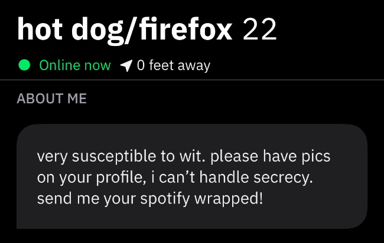
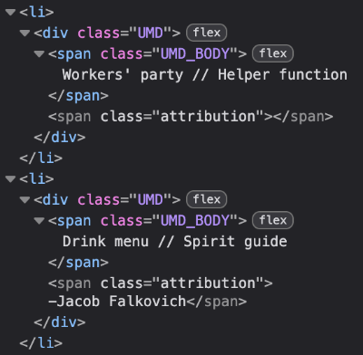

# Unparalleled Misalignments
I love Unparalleled Misalignments, a genius piece of wordplay coined by [Ricki Heicklen](https://rickiheicklen.com/) that's described as "pairs of non-synonymous phrases where the words in one phrase are each synonyms of the words in the other."

But, it's easier to get the gist by looking at examples. Some are faithful, understandable, and almost fated, such as `Underdog // Subwoofer` or `Graphing calculator // Plot device`. Some only work in writing, breaking down once pronounced, such as `TED talk // Edward Said`. Others are a bit of a stretch, such as one created by my dear friend [Renata](https://sewergirl.neocities.org/): `Quick buck // First rodeo`. Ricki has maintained a [huge list](https://rickiheicklen.com/unparalleled-misalignments.html) of Unparalleled Misalignments alongside the world's creative writers, which I scroll endlessly.

# Grindr
Unlike Unparalleled Misalignments, I simply tolerate Grindr. For those uninitiated, Grindr is a geosocial dating app, primarily used by gay men, trans women, or otherwise queer people to meet others. But, it is almost exclusively used in practice to organize hookups.

Grindr is an [actively hostile platform](https://www.vox.com/culture/479175/is-grindr-dead) in both its design and use. Unlike dating apps like Tinder, Grindr is organized not by an invisible algorithm, but by other users' spatial proximity--the "grid" is simply an ordered list of users closest to you. In their profile, users are given slots for a handful of images and personal attributes, as well as a profile username.

Users can filter this list by personal preferences, such as age, body type, or inclusion of photos in their profile. But, importantly, these preferences are not mutual. Users are not obligated to provide any information, even photos, about themselves in their profile, any user can view your profile or send likes and messages unless manually blocked or hidden.

This quality points towards the need for many Grindr users to find other ways to limit who chooses to interact with them, and for what reasons. Grindr provides a short profile description, but users are notorious for ignoring directly-stated preferences, or choosing not to read them entirely. This is a serious issue for those most comfortable with sexual intimacy following some amount of familiarity. Or, a little chat, at the very least.

As a result, this is most effectively done by carefully manicuring the personality you project onto your profile through photos and text descriptions. Too little, and other users feel free to send me pictures of their penis unprompted. Too much restraint or anonymity, and potential partners may perceive me as rejecting the inherently sexual nature of the platform, being in the closet, or holding a desire to harvest other users' explicit photos with no intent of providing any of my own, qualities I don't intend to communicate.

# So, how?
My method of choice is to be a little odd. It's not terribly different from how I act day-to-day; grounded as much as I can in humility with my tongue sometimes planted in my cheek. My profile is complete, punny, unusually earnest. It's pretty good at communicating what I want out of the platform. But, because having to stare at my own static profile is boring, I've had a lot of fun trying to think of a new username every week or so.



This is what made me return to Unparalleled Misalignments--fun, short pieces of wordplay, almost puzzle-like. They're hard to understand unless you know their rules, becoming unintentional conversation starters. The problem is the pesky 15-character Grindr username cap. Unparalleled Misalignments frequently contain multiple words on each sides separated by a four-character delimiter: ` // `. This makes it exceedingly hard to force them into something suitable for Grindr.

Though, some of these problems have pretty obvious solutions: spaces can be substituted by `PascalCase`, and the lengthy delimiter can be replaced by a simple `/`. For a time, I did this manually, combing through the list until I found one short enough to mangle into something usable. But, this is a trivially simple system to automate.

# Let's automate it
First, we need to collect all of the Unparalleled Misalignments in simple text form. Ricki made this super easy, since each entry is contained in a `<span>` with the class `UMD_BODY` under a container with the class `UMD_LIST`.



We can fetch the page, parse the resulting document as DOM, perform a query selector of `.UMD_LIST .UMD_BODY`, and pull out each matched element's text content:

```javascript
const response = await fetch(
    "https://rickiheicklen.com/unparalleled-misalignments.html",
);
const doc = new DOMParser().parseFromString(
    await response.text(),
    "text/html",
);

const entries = [];
const validEntries = [];

const entryObjects = doc.querySelectorAll(".UMD_LIST .UMD_BODY");
for (const entry of entryObjects) entries.push(entry.innerHTML);
```

We can immediately discard all entries with more than 14 alpha characters, since adding any sort of delimiter--required for a well-formed Unparalleled Misalignment--would push it over the 15 character limit:

```javascript
const possibleEntries = [];
for (const entry of entries)
    if ((entry.match(/[a-zA-Z]/g) || []).length < 15)
        possibleEntries.push(entry);
```

Here, we get to the first stop. We can pull out any entry that already contains 15 characters or less, meaning we don't have to do anything to them in order to fit them in a Grindr username:

```javascript
const nontrivialEntries = [];
for (const entry of possibleEntries) {
    if (entry.length <= 15) validEntries.push(entry);
    else nontrivialEntries.push(entry);
}
```

The resulting list is really disappointing. Turns out, only one of them fits:
- G20 // IQ Score

We can "create" more valid entries by manipulating how they're displayed. First, we can remove the spaces around the double slash:

```javascript
const trimmedDelimiterEntries = [];
for (const entry of nontrivialEntries) {
    const newEntry = entry.replace(" // ", "//");
    if (newEntry.length <= 15) validEntries.push(newEntry);
    else trimmedDelimiterEntries.push(newEntry);
}
```

This adds a few more to our list:
- Fuckboy//Layman
- CFAR//Longview
- Amtrak//Beeline
- Umpire//Aflame

If that still doesn't work, we can turn the double slash into a single slash:
```javascript
const minimalDelimiterEntries = [];
for (const entry of trimmedDelimiterEntries) {
    const newEntry = entry.replace("/", "/");
    if (newEntry.length == 15) validEntries.push(newEntry);
    else minimalDelimiterEntries.push(newEntry);
}
```

Expectedly, a number of entries were right on the cusp, adding 13 new valid entries:
- Iron man/Female
- Viceroy/Sinking
- Cat Eye/Purview
- Airpod/Gas Tank
- IMAX/Vision Pro
- Seesaw/Sawblade
- Cash Cow/Feeble
- Tech bro/E-mail
- Hot dog/Firefox
- Carton/Driveway
- Deadwood/Latent
- Unsong/One-note
- Dragon/Pullover

Finally, we can remove any spaces and make the next character uppercase, essentially converting the text into `PascalCase`:

```javascript
const pascalCaseEntries = [];
for (const entry of minimalDelimiterEntries) {
    const newEntry = entry
        .replace(/(?:^|\s+)(\S)/g, (_, c) => c.toUpperCase())
        .replace(/\s+/g, "");
    if (newEntry.length <= 15) validEntries.push(newEntry);
    else pascalCaseEntries.push(newEntry);
}
```

This gives us our finished list of 34 entries (including the ones from earlier):
- G20 // IQ Score
- Fuckboy//Layman
- CFAR//Longview
- Amtrak//Beeline
- Umpire//Aflame
- Iron man/Female
- Viceroy/Sinking
- Cat Eye/Purview
- Airpod/Gas Tank
- IMAX/Vision Pro
- Seesaw/Sawblade
- Cash Cow/Feeble
- Tech bro/E-mail
- Hot dog/Firefox
- Carton/Driveway
- Deadwood/Latent
- Unsong/One-note
- Dragon/Pullover
- OkayBoomer/KPop
- PenPal/Cellmate
- Update/HighTime
- NoShit/BarStool
- Menu/BoysSchool
- Contour/BadTrip
- Believe/BuzzOff
- Feline/IronWire
- AlphaMales/Amen
- ArmLock/GunSafe
- OralSex/Jawbone
- StreetSmarts/GG
- SpruceUp/LogOut
- BadBoy/JunkMail
- GoogleDoc/WebMD
- HeatSink/HotTub

These are all of the Unparalleled Misalignments you can fit in a Grindr username without doing any messy abbreviation. Go wild.
