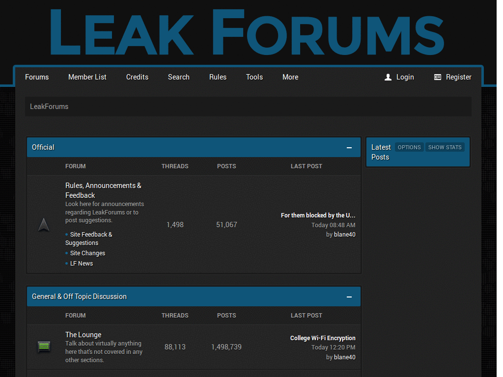
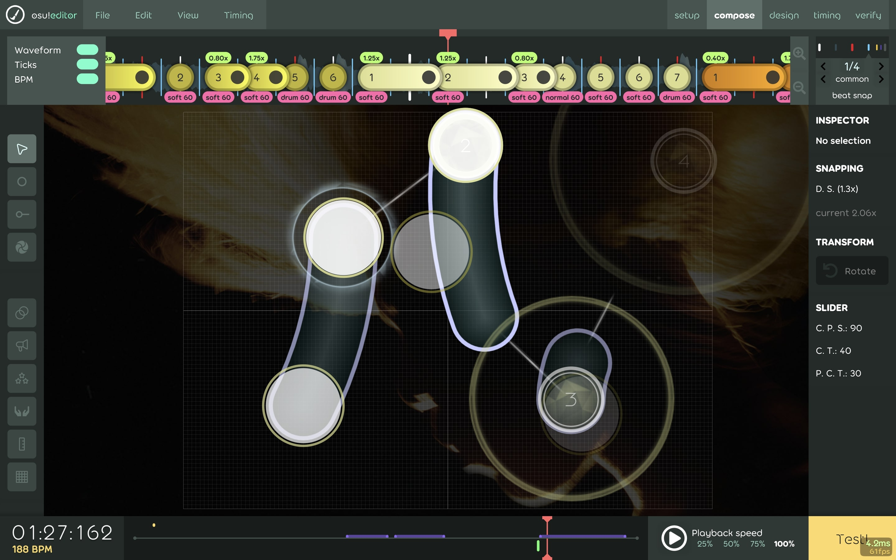
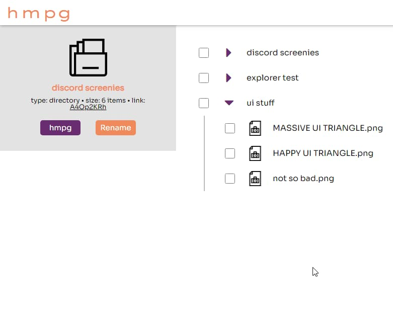

This is the first (mostly anecdotal) piece in a larger exploration of the future of social media platforms.

From an insulated & isolated suburb, algorithmic social media turned me from an unconfident, angry kid into an aesthetically-engaged, witty, openly-gay man. As advocates for the classic, federated web push back on retention-based social media platforms, I worry for the kids growing up in my shoes. Contrasting with the time- and knowledge-intensive curation process required to effectively use platforms like Mastodon and curate rich RSS feeds, I believe the persistence of easy-to-use, algorithmic, exploratory feeds are crucial for identity formation. But, how do we build platforms that fill this role without compromising on data privacy or becoming a breeding ground for social comparison that erodes self-image?

Much of my early- to mid-teens were spent on amateur hacking forums I was way too young for, playing competitive multiplayer games that made me so frustrated my parents could hear me yelling from downstairs. That anger and online delinquency wasn’t a cover for anything, I don’t think; I was treated well by my peers, lacked the internalized homophobia often present in boys my age (although I wasn’t quite ready to come out yet), and had a great relationship with my siblings and parents. I can confidently attribute it to spending energy in the wrong places for me, neglecting the creative and aesthetic engagement that I didn’t know I needed. 

*LeakForums, the ameteur hacking forum I spent a lot of time on as an early teen.*

Over time, I started to discover exceptions to this pattern. As a tween, I stumbled upon the game [osu!](https://osu.ppy.sh/) through a livestream on Twitch, which modeled a form of gaming that enriched my life instead of taking from it. osu! is a rhythm game, much like Dance Dance Revolution or Guitar Hero, but its desktop-based, free-to-win nature makes it incredibly unique. osu! is what you make of it; a “thing” to get good at, a competitive leaderboard to conquer, a set of play styles to try on for size. But, for the most part, osu! is played solo. My failure couldn’t be blamed on anyone else, which diffused my anger so effectively that it forever changed the way I engage with gaming, sports, and music. Early in high school, I finally realized the damage that competitive multiplayer was doing to my mood, so I decided to ditch them in favor of games like osu! and survival Minecraft. This modeled the sorts of collaboration and healthy competition that would start to transform my relationship to the internet.

*My map of Romanticist by Yves Tumor, an activity that characterized my time on osu!*

Despite my progress in gaming, it wasn’t until TikTok’s takeover during the pandemic that I was shown the things that would tear my life right open. Moreso than anything that came before it, TikTok is incredibly good at picking up burgeoning interests and identifications, magnifying and directing them towards the communities built around them. For the first time in my life, I was exposed to more than the handful of queer people and people of color that existed within my school, an experience that most white gay suburbanites first experience if they fall into the right college friend groups.

Through the internet, I saw a huge breadth of queer aesthetic expression, an experience that transformed my rather hype-fueled interest in streetwear into a love of thrifting androgynous tailoring and slowly building a collection of secondhand designer (much to the joy of my mother, who had been thrifting our wardrobes for the first decade of me and my sibling’s lives). I started posting on the subreddit r/malefashion—the home of avant-garde clothing on Reddit until the API changes in 2023 killed it—whose members graciously directed me towards discord communities filled with people who would then become my closest online friends. This was my first healthy adult social space, and I owe a lot to them.

Aesthetically-engaged young people of the pandemic also had a growing fascination with the early-2000s internet, specifically platforms like Geocities and MySpace which had strong cultures of customization and individual flair. This fascination led me to my first real personal coding project, a (ill-conceived) social media and file-hosting platform that I poured the summer of 2020 into. Even though it expectedly went nowhere, it lit the initial fire under my ever-present love of building software on the web.

*A screenshot of hmpg.io, my first foray into full-stack web programming, shortly before I abandoned it.*

Similarly, I found myself immersed in the world of internet music, which broke me out of my half-decide-long stint of defining my music taste based on the games that I played. Spotify recommended Clarence Clarity’s “no now” during my near-daily walks in the park near my house, sending me down the experimental pop rabbit hole which would lead me towards my first few live concerts in Boston.

At its best, algorithmic feeds feel like wandering through a city street. stimuli is varied, accessible, and acts as a jumping off point for engaging with new communities. But for those of us not privileged enough (or in my case, too privileged) to spend adolescence in lively, diverse urban areas, social media formed a decent alternative. I don’t think the problem lies in algorithmic discovery, but the specific corporate incentives to keep users on their platforms no matter what.

I feel like many of the people pushing towards a federated, conscious, intentional web landscape tend to know who they are and what they want out of the internet. It’s an easy thing to forget going through if you’ve worked with computers for multiple decades, but as someone whose “real” identity only started to crystallize in high school during the pandemic, it’s fresh in my mind. Though I have more appreciation for the slow web nowadays, where my identity is a bit more solidified, I still feel a pretty strong pull towards "the platform", and my visions for a healthier internet include it.

The future is the piece I’m the least sure of. It’s obvious that algorithmic feeds have a lot to do with plenty of incredibly harmful societal effects: the dissemination of fake news and misinformation on Facebook that [shaped the 2016 Trump campaign](https://www.theverge.com/2017/10/30/16578022/facebook-senate-testimony-russia-126-million-people), Instagram’s impact on the [self-image of teenage girls](https://www.nature.com/articles/s41599-024-02960-3), the proliferation of brain rot and rage bait content across all of short-form video, and the pull that young men feel towards radicalization as a misplaced response to the struggles they face. All of these are completely separate from the deep privacy concerns of trading your personal information for participation in a platform. But, there’s something to be said about having a wide variety of interests, people, and culture thrown at you that, in a small way, makes up for an upbringing that doesn’t.

From the countless platforms that have been proposed or created to help address the issues of contemporary social media use, I have seen a few patterns emerge:
- Bluesky, Mastodon, or other federated Twitter alternatives
- Blogging, RSS, and link aggregation, following the “post on own site, syndicate elsewhere” paradigm
- Matrix, Stoat, and other Discord alternatives meant to provide an internet “third place”
- Neocities and webrings, platforms and conventions intentionally modeled after the old internet
- are.na or other content organization platforms
- Substack, Medium, dev.to, and other micropublishers

Although I am not the right person to break all of these categories down, I can say that none of them replicate the core utility of algorithmic feeds, opting to instead make a barrier of entry out of the effort required to curate content and use these platforms effectively. This is very good for the type of conscious internet user who would seek out alternatives to mainstream platforms in the first place, but hardly a magnet for the sort of varied, apathetic, witty posting that makes X and TikTok so entertaining to use, if ultimately damaging.

A few solutions have been proposed to help fix algorithmic feeds directly. The first layer is algorithmic transparency, a strategy that X [tried to employ](https://techcrunch.com/2026/01/20/x-open-sources-its-algorithm-while-facing-a-transparency-fine-and-grok-controversies/) that makes the internals of the platform’s recommendation algorithm visible to all. Unsurprisingly, this code is redacted, incredibly complex, and relies on large language models to rank posts. bluesky offers plural feeds through their [AT protocol](https://docs.bsky.app/docs/advanced-guides/atproto), which allows users to create their own logic for what posts to include and where, including full account portability to other platforms. This is awesome and promising, but is fairly low-level and creates similar curation barriers as other federated platforms.

For these technologies to be adopted, we may have to live in a society much different than the present. To proliferate alternative social media as it currently exists, users of the web may have to expect curation effort by default. To make healthy yet low-friction algorithmic feeds possible, we may have to rid social platforms of the overwhelming profit incentive and operational costs that drive platforms towards retention-based algorithms and predatory data policies in the first place. Either way, we may have to perceive social media platforms as a service worth paying for in addition to an internet connection.

I am hopeful that the lowering costs of energy and hosting hardware will make large social media platforms cheaper to run, and that educators will get better at teaching young people to be more deliberate about the ways they interact with the web. I hope that a healthier social media will break its way into the real mainstream, enabling younger generations to find a richer life like I did. But, for now, we each have to forge our own path through the internet, engaging with our community to help undo the damage, and support the beauty, that modern social media encourages.
